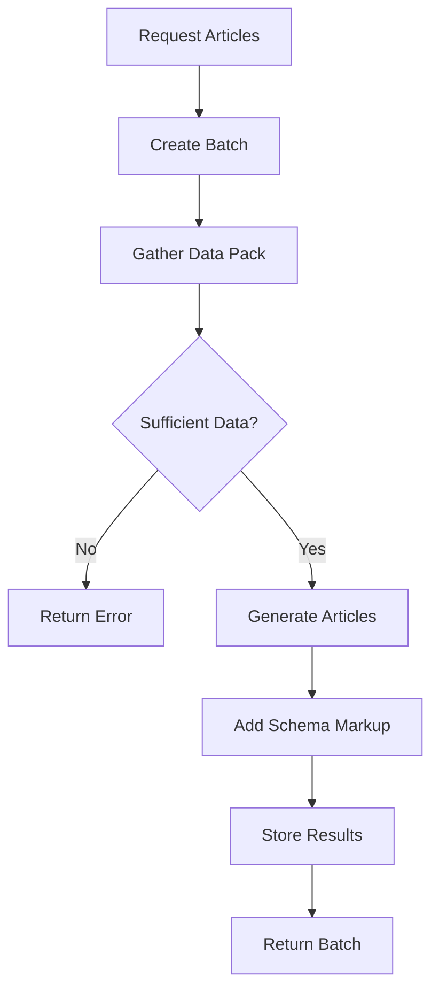

## Overview

The AI Content Generation system creates complete, publication-ready articles optimized for both traditional SEO and Generative Engine Optimization (GEO). It leverages advanced LLMs to generate content that AI search engines will cite and recommend.

## Article Engine Workflow

The article engine follows a strict data-driven process:



### 1. Create Article Batch

Submit a request to generate multiple articles:

```bash
POST /api/v1/geo/article-engine/generate
{
  "audit_id": 123,
  "article_count": 3,
  "language": "en",
  "tone": "executive",
  "include_schema": true,
  "market": "US",
  "run_async": true
}
```

**Parameters:**
- `article_count`: 1-12 articles per batch
- `language`: Target language code (en, es, fr, etc.)
- `tone`: Writing style (executive, casual, technical, friendly)
- `include_schema`: Auto-generate Article schema
- `market`: Target market for localization
- `run_async`: Process in background (recommended for >1 article)

### 2. Data Pack Assembly

The engine gathers comprehensive context:

#### Required Data Sources

- **Audit Results**: Technical SEO findings, scores
- **Keywords**: Target keywords with volume/difficulty
- **Competitors**: Top 3-5 competitor analysis
- **Query Opportunities**: High-potential discovery queries
- **Citations**: Current LLM citation data

#### Authority Sources Requirement

Articles require **minimum 3 authoritative sources**:

- Academic papers and research
- Industry reports and whitepapers
- Government/official statistics
- Recognized expert opinions
- Peer-reviewed publications

<Warning>
If insufficient authority sources are available, the batch will fail with `INSUFFICIENT_AUTHORITY_SOURCES` error. Run competitor analysis and query discovery first to build the data pack.
</Warning>

### 3. Content Generation

Each article is generated with:

✓ **Optimized Structure**: H1, H2, H3 hierarchy  
✓ **Citation-Ready Blocks**: Direct answer sections  
✓ **External References**: Links to authority sources  
✓ **Data & Statistics**: Supporting evidence  
✓ **FAQ Sections**: Common questions with schema  
✓ **Author Attribution**: Credibility signals  
✓ **Schema Markup**: Article/FAQPage JSON-LD  

### 4. Schema Integration

If `include_schema: true`, each article includes:

```json
{
  "@context": "https://schema.org",
  "@type": "Article",
  "headline": "How to Optimize for AI Search Engines",
  "author": {
    "@type": "Person",
    "name": "Sarah Chen",
    "jobTitle": "SEO Director"
  },
  "datePublished": "2026-03-03",
  "dateModified": "2026-03-03",
  "publisher": {
    "@type": "Organization",
    "name": "YourBrand",
    "logo": {
      "@type": "ImageObject",
      "url": "https://yourbrand.com/logo.png"
    }
  },
  "mainEntityOfPage": {
    "@type": "WebPage",
    "@id": "https://yourbrand.com/article"
  },
  "articleBody": "..."
}
```

## LLM Integration

### Supported Providers

#### 1. Kimi (Primary)

- **Model**: Kimi 2.5 with web search
- **Strengths**: Real-time web search, multilingual, fast
- **Use cases**: Research, fact-checking, competitor analysis
- **Configuration**: `NV_API_KEY_ANALYSIS` or `NV_API_KEY`

```bash
# Environment setup
NV_API_KEY_ANALYSIS=your-kimi-api-key
KIMI_MODEL_NAME=kimi-2.5-latest
```

#### 2. OpenAI (Alternative)

- **Model**: GPT-4 or GPT-3.5-turbo
- **Strengths**: High-quality writing, broad knowledge
- **Use cases**: Content generation, summarization
- **Configuration**: `OPENAI_API_KEY`

```bash
# Environment setup
OPENAI_API_KEY=your-openai-api-key
OPENAI_MODEL_NAME=gpt-4-turbo-preview
```

<Info>
Kimi is preferred for GEO content due to real-time web search capabilities. OpenAI models work well for general content but lack live data access.
</Info>

### LLM Configuration

The engine automatically selects the best available LLM:

```python
# Priority order
1. Kimi (if NV_API_KEY_ANALYSIS set)
2. OpenAI (if OPENAI_API_KEY set)
3. Error (no LLM configured)
```

## Article Batch Status

### Batch States

- **pending**: Batch created, waiting to process
- **processing**: Generating articles
- **completed**: All articles generated successfully
- **partial_success**: Some articles generated, some failed
- **failed**: Batch failed (see error details)

### Checking Status

```bash
GET /api/v1/geo/article-engine/status/{batch_id}
```

**Response:**

```json
{
  "has_data": true,
  "batch_id": 456,
  "audit_id": 123,
  "status": "completed",
  "created_at": "2026-03-03T10:30:00Z",
  "summary": {
    "total_requested": 3,
    "generated_count": 3,
    "failed_count": 0,
    "task_id": "celery-task-uuid"
  },
  "articles": [
    {
      "title": "Complete Guide to GEO Optimization",
      "content_html": "<article>...</article>",
      "word_count": 2500,
      "schema_markup": "{...}",
      "suggested_url": "/blog/geo-optimization-guide",
      "target_keywords": ["geo optimization", "ai search"],
      "authority_sources": [
        "https://searchengineland.com/...",
        "https://moz.com/..."
      ]
    }
  ]
}
```

### Get Latest Batch

```bash
GET /api/v1/geo/article-engine/latest/{audit_id}
```

Returns the most recent batch for an audit.

## Content Template Usage

Articles follow GEO-optimized templates:

### Guide Template

```markdown
# [Topic]: Complete Guide for [Year]

## Introduction
[Problem statement and overview]

## What is [Topic]?
[Definition with citations]

## Why [Topic] Matters
[Benefits with data]

## How to [Action]
### Step 1: [First Step]
### Step 2: [Second Step]
...

## Common Challenges
[Problems and solutions]

## Best Practices
[Expert recommendations]

## FAQ
[Schema-ready Q&A]

## Conclusion
[Summary and CTA]
```

### Comparison Template

```markdown
# [Product A] vs [Product B]: Which is Better?

## Overview
[Quick comparison summary]

## Feature Comparison
| Feature | Product A | Product B |
|---------|-----------|----------|

## Pros and Cons
### [Product A]
✓ Pros: ...
✗ Cons: ...

### [Product B]
✓ Pros: ...
✗ Cons: ...

## Use Cases
[When to use each]

## Verdict
[Recommendation based on needs]

## FAQ
[Common comparison questions]
```

## Error Handling

### Common Errors

#### KIMI_UNAVAILABLE (503)

```json
{
  "code": "KIMI_UNAVAILABLE",
  "message": "Service temporarily unavailable."
}
```

**Solution**: Check Kimi API key and service status

#### ARTICLE_DATA_PACK_INCOMPLETE (422)

```json
{
  "code": "ARTICLE_DATA_PACK_INCOMPLETE",
  "message": "Required article data pack is incomplete."
}
```

**Solution**: 
1. Ensure audit is completed
2. Run competitor analysis
3. Run query discovery
4. Verify keywords exist

#### INSUFFICIENT_AUTHORITY_SOURCES (422)

```json
{
  "code": "INSUFFICIENT_AUTHORITY_SOURCES",
  "message": "Insufficient authority sources."
}
```

**Solution**:
1. Run competitor citation analysis
2. Add more keywords to expand research
3. Manually specify authority sources
4. Use broader topic scope

#### KIMI_GENERATION_FAILED (502)

```json
{
  "code": "KIMI_GENERATION_FAILED",
  "message": "Upstream generation dependency failed."
}
```

**Solution**: Retry request; may be temporary LLM issue

## Async vs Sync Processing

### Async (Recommended)

```json
{
  "run_async": true
}
```

**Benefits:**
- Non-blocking request (instant response)
- Better for multiple articles
- Uses Celery background workers
- Can check status later

**Use when:**
- Generating 2+ articles
- Creating complex content
- High server load

### Sync

```json
{
  "run_async": false
}
```

**Benefits:**
- Immediate results in response
- Simpler error handling
- No status polling needed

**Use when:**
- Generating 1 article
- Testing/development
- Low latency required

<Warning>
Sync processing times out after 120 seconds. Use async for article counts > 1.
</Warning>

## Best Practices

### Data Preparation

✓ Complete audit before generating articles  
✓ Run competitor analysis first  
✓ Add 10+ target keywords  
✓ Discover query opportunities  
✓ Have 3+ competitors configured  

### Content Quality

✓ Use `executive` or `technical` tone for B2B  
✓ Use `casual` or `friendly` tone for B2C  
✓ Always include schema markup  
✓ Request 2-5 articles per batch (optimal)  
✓ Review and edit generated content  

### Performance

✓ Use async for batches > 1 article  
✓ Generate during off-peak hours  
✓ Monitor Celery worker queue  
✓ Cache authority sources  
✓ Reuse batches when possible  

### SEO/GEO Optimization

✓ Include FAQ sections with schema  
✓ Link to authority sources  
✓ Add author credentials  
✓ Use structured headings  
✓ Include data and statistics  
✓ Optimize for featured snippets  

## Example Workflow

### Complete Article Generation Flow

```typescript
// 1. Ensure audit is complete
const audit = await getAudit(auditId);
if (audit.status !== 'completed') {
  throw new Error('Wait for audit completion');
}

// 2. Check data pack readiness
const hasKeywords = await checkKeywords(auditId);
const hasCompetitors = await checkCompetitors(auditId);
if (!hasKeywords || !hasCompetitors) {
  throw new Error('Run competitor analysis and keyword research first');
}

// 3. Request article batch
const batch = await fetch('/api/v1/geo/article-engine/generate', {
  method: 'POST',
  headers: { 'Content-Type': 'application/json' },
  body: JSON.stringify({
    audit_id: auditId,
    article_count: 3,
    language: 'en',
    tone: 'executive',
    include_schema: true,
    run_async: true
  })
}).then(r => r.json());

// 4. Poll for completion
let status = 'processing';
while (status === 'processing' || status === 'pending') {
  await sleep(5000);
  const result = await fetch(
    `/api/v1/geo/article-engine/status/${batch.batch_id}`
  ).then(r => r.json());
  status = result.status;
}

// 5. Retrieve articles
if (status === 'completed') {
  const articles = batch.articles;
  // Publish or review articles
  articles.forEach(article => {
    console.log('Article:', article.title);
    console.log('Word count:', article.word_count);
    console.log('Keywords:', article.target_keywords);
  });
} else {
  console.error('Batch failed:', status);
}
```

## Monitoring Generation

### Celery Worker Logs

```bash
# Monitor async article generation
docker compose logs -f celery-worker | grep "article"

# Check task queue
docker compose exec redis redis-cli LLEN celery

# Monitor worker health
docker compose exec celery-worker celery -A app.workers.celery_app inspect active
```

### Database Queries

```sql
-- Recent article batches
SELECT * FROM article_generation_batches 
ORDER BY created_at DESC 
LIMIT 10;

-- Success rate
SELECT 
  status,
  COUNT(*) as count
FROM article_generation_batches
GROUP BY status;
```

## Next Steps

<CardGroup cols={2}>
  <Card title="GEO Optimization" icon="sparkles" href="/features/geo-optimization">
    Learn about GEO content strategies
  </Card>
  <Card title="Content Templates" icon="file-lines" href="/features/geo-optimization#content-templates">
    Explore pre-built templates
  </Card>
  <Card title="Schema Generation" icon="code" href="/features/geo-optimization#schema-optimization">
    Generate schema markup
  </Card>
  <Card title="Analytics" icon="chart-line" href="/features/analytics">
    Track content performance
  </Card>
</CardGroup>