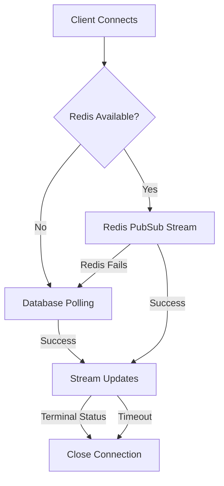

## Overview

LatentGEO uses **Server-Sent Events (SSE)** to stream real-time audit progress updates to your dashboard. This eliminates the need for constant polling, reducing server load and providing instant feedback as audits progress.

## How SSE Works

SSE creates a persistent, one-way connection from server to client:

1. **Client connects** to SSE endpoint with authentication
2. **Server streams events** as audit progresses
3. **Client receives updates** instantly without polling
4. **Connection closes** when audit completes or fails

### Benefits over Polling

| Feature | SSE | Traditional Polling |
|---------|-----|---------------------|
| **Latency** | Instant | Depends on poll interval |
| **Server Load** | Low (1 connection) | High (constant requests) |
| **Bandwidth** | Minimal | High (repeated headers) |
| **Real-time** | True real-time | Delayed by interval |
| **Complexity** | Built-in browser support | Custom implementation |

## Architecture

### Three-Tier Fallback System

LatentGEO implements a robust fallback system:



#### 1. Redis PubSub (Primary)

- **Lowest latency**: Sub-second updates
- **Highest efficiency**: Push-based, no polling
- **Best for production**: Scales horizontally

```python
# Worker publishes to Redis
redis.publish(f"audit:progress:{audit_id}", json.dumps(payload))

# SSE endpoint subscribes
pubsub.subscribe(f"audit:progress:{audit_id}")
```

#### 2. Database Polling (Fallback)

- **Automatic fallback**: When Redis unavailable
- **Configurable interval**: Default 10 seconds
- **Reliable**: Always works if DB accessible

```python
# Falls back to DB every N seconds
if not redis_available:
    payload = load_audit_from_db(audit_id)
    yield payload
    await asyncio.sleep(fallback_interval)
```

#### 3. Client Polling (Last Resort)

- **Frontend fallback**: If SSE fails entirely
- **Uses standard REST**: GET `/api/v1/audits/{audit_id}/status`
- **Graceful degradation**: Still functional

<Info>
The frontend automatically detects SSE failures and switches to polling without user intervention.
</Info>

## SSE Configuration

Configure SSE behavior via environment variables:

```bash
# Primary data source
SSE_SOURCE=redis  # "redis" or "db"

# Connection timeouts
SSE_MAX_DURATION=3600  # Maximum connection duration (seconds)
SSE_RETRY_MS=5000      # Client retry interval (milliseconds)

# Heartbeat and fallback
SSE_HEARTBEAT_SECONDS=30              # Keep-alive interval
SSE_FALLBACK_DB_INTERVAL_SECONDS=10   # DB polling interval when Redis fails
```

### Configuration Scenarios

#### Production (Redis-first)

```bash
SSE_SOURCE=redis
SSE_MAX_DURATION=3600
SSE_HEARTBEAT_SECONDS=30
SSE_FALLBACK_DB_INTERVAL_SECONDS=10
SSE_RETRY_MS=5000
```

- Uses Redis PubSub for instant updates
- Falls back to DB polling every 10s if Redis fails
- Heartbeat every 30s to keep connection alive
- Clients retry after 5s if disconnected

#### Development (DB-only)

```bash
SSE_SOURCE=db
SSE_FALLBACK_DB_INTERVAL_SECONDS=5
SSE_HEARTBEAT_SECONDS=15
```

- Skips Redis entirely
- Polls database every 5 seconds
- Faster heartbeat for testing

#### High-volume (Optimized)

```bash
SSE_SOURCE=redis
SSE_MAX_DURATION=7200
SSE_HEARTBEAT_SECONDS=60
SSE_FALLBACK_DB_INTERVAL_SECONDS=30
```

- Longer connection duration
- Less frequent heartbeats
- Slower fallback to reduce DB load

## Using SSE from Frontend

### JavaScript/TypeScript Example

```typescript
const eventSource = new EventSource(
  `/api/v1/sse/audits/${auditId}/progress`,
  {
    withCredentials: true  // Include auth cookies
  }
);

eventSource.onmessage = (event) => {
  const progress = JSON.parse(event.data);
  console.log('Audit progress:', progress);
  
  // Update UI
  updateProgressBar(progress.progress);
  updateStatus(progress.status);
  
  // Close on completion
  if (progress.status === 'completed' || progress.status === 'failed') {
    eventSource.close();
  }
};

eventSource.onerror = (error) => {
  console.error('SSE error:', error);
  eventSource.close();
  
  // Fallback to polling
  startPolling(auditId);
};
```

### React Hook Example

```typescript
import { useEffect, useState } from 'react';

interface AuditProgress {
  audit_id: number;
  status: string;
  progress: number;
  geo_score?: number;
  total_pages?: number;
}

function useAuditProgress(auditId: number) {
  const [progress, setProgress] = useState<AuditProgress | null>(null);
  const [error, setError] = useState<Error | null>(null);

  useEffect(() => {
    const eventSource = new EventSource(
      `/api/v1/sse/audits/${auditId}/progress`
    );

    eventSource.onmessage = (event) => {
      const data = JSON.parse(event.data);
      setProgress(data);

      // Auto-close on terminal status
      if (data.status === 'completed' || data.status === 'failed') {
        eventSource.close();
      }
    };

    eventSource.onerror = (err) => {
      setError(new Error('SSE connection failed'));
      eventSource.close();
    };

    return () => {
      eventSource.close();
    };
  }, [auditId]);

  return { progress, error };
}

// Usage
function AuditDashboard({ auditId }: { auditId: number }) {
  const { progress, error } = useAuditProgress(auditId);

  if (error) {
    return <div>Error: {error.message}</div>;
  }

  if (!progress) {
    return <div>Connecting...</div>;
  }

  return (
    <div>
      <h2>Audit Progress</h2>
      <div>Status: {progress.status}</div>
      <div>Progress: {progress.progress}%</div>
      <progress value={progress.progress} max={100} />
    </div>
  );
}
```

### Next.js API Route Proxy

If you need to proxy SSE through Next.js:

```typescript
// pages/api/sse/[auditId].ts
import type { NextApiRequest, NextApiResponse } from 'next';

export const config = {
  api: {
    bodyParser: false,
    responseLimit: false,
  },
};

export default async function handler(
  req: NextApiRequest,
  res: NextApiResponse
) {
  const { auditId } = req.query;
  const token = req.cookies.auth_token;

  // Set SSE headers
  res.setHeader('Content-Type', 'text/event-stream');
  res.setHeader('Cache-Control', 'no-cache, no-transform');
  res.setHeader('Connection', 'keep-alive');
  res.setHeader('X-Accel-Buffering', 'no');

  // Proxy to backend
  const response = await fetch(
    `http://backend:8000/api/v1/sse/audits/${auditId}/progress`,
    {
      headers: {
        Authorization: `Bearer ${token}`,
      },
    }
  );

  // Stream response
  const reader = response.body?.getReader();
  if (!reader) return;

  while (true) {
    const { done, value } = await reader.read();
    if (done) break;
    res.write(value);
  }

  res.end();
}
```

## Progress Payload Structure

```typescript
interface ProgressPayload {
  audit_id: number;
  status: 'pending' | 'running' | 'completed' | 'failed';
  progress: number;  // 0-100
  url: string;
  
  // Optional fields (populated as audit progresses)
  geo_score?: number;
  total_pages?: number;
  critical_issues?: number;
  high_issues?: number;
  medium_issues?: number;
  low_issues?: number;
  error_message?: string;  // Only on failure
}
```

## Monitoring SSE Health

### Server-Side Logging

SSE events are logged for debugging:

```bash
# Connection established
INFO: SSE connection established for audit 123

# Redis subscription
INFO: SSE Redis subscribed: audit:progress:123

# Redis failure (auto-fallback)
WARNING: SSE Redis read failed for audit 123: Connection timeout

# Client disconnect
INFO: SSE client disconnected for audit 123

# Stream completion
INFO: SSE stream ended for audit 123: completed
```

### Docker Compose Logs

```bash
# Monitor backend SSE activity
docker compose logs -f backend | grep SSE

# Monitor Redis pubsub
docker compose exec redis redis-cli PSUBSCRIBE 'audit:progress:*'

# Monitor all services
docker compose logs -f
```

## Troubleshooting

### Issue: No Updates Received

**Symptoms**: SSE connects but no progress events arrive

**Diagnosis**:
1. Check Redis connectivity:
   ```bash
   docker compose logs redis
   docker compose exec redis redis-cli PING
   ```
2. Verify SSE_SOURCE setting:
   ```bash
   echo $SSE_SOURCE
   ```
3. Check worker publishing:
   ```bash
   docker compose logs -f backend | grep "progress update"
   ```

**Solutions**:
- Ensure Redis is running and accessible
- Verify `SSE_SOURCE=redis` if using Redis
- Check that worker publishes to correct channel
- Review `SSE_FALLBACK_DB_INTERVAL_SECONDS` for DB fallback

### Issue: Connection Timeout

**Symptoms**: SSE disconnects before audit completes

**Solutions**:
- Increase `SSE_MAX_DURATION` for long audits
- Check `SSE_HEARTBEAT_SECONDS` is not too long
- Verify reverse proxy timeout settings (Nginx, etc.)
- Review client-side timeout configuration

### Issue: High Server Load

**Symptoms**: Many SSE connections cause performance issues

**Solutions**:
- Enable Redis if using DB polling
- Increase `SSE_HEARTBEAT_SECONDS` to reduce traffic
- Increase `SSE_FALLBACK_DB_INTERVAL_SECONDS` for DB fallback
- Scale backend horizontally
- Use CDN for static content

### Issue: SSE Not Working in Browser

**Symptoms**: EventSource fails to connect

**Solutions**:
- Check CORS configuration
- Verify authentication headers
- Check browser console for errors
- Test with `curl` to isolate frontend issues:
  ```bash
  curl -N -H "Authorization: Bearer $TOKEN" \
    http://localhost:8000/api/v1/sse/audits/123/progress
  ```

## Best Practices

### Client-Side

✓ Always implement polling fallback  
✓ Close EventSource on unmount/navigation  
✓ Handle reconnection logic  
✓ Show connection status in UI  
✓ Implement exponential backoff for retries  

### Server-Side

✓ Use Redis in production  
✓ Set appropriate timeouts  
✓ Log connection lifecycle events  
✓ Monitor Redis health  
✓ Implement rate limiting  

### Configuration

✓ Match heartbeat to network conditions  
✓ Set max duration based on audit time  
✓ Tune fallback interval for load balance  
✓ Test failover scenarios  
✓ Document settings for team  

## Performance Metrics

Typical SSE performance:

| Metric | Redis | DB Fallback | Polling |
|--------|-------|-------------|----------|
| **Latency** | &lt;100ms | 5-10s | 5-30s |
| **Overhead** | ~1KB/min | ~5KB/min | ~50KB/min |
| **Connections** | 1 persistent | 1 persistent | N requests |
| **Server Load** | Minimal | Low | High |

## Next Steps

<CardGroup cols={2}>
  <Card title="Audits" icon="magnifying-glass" href="/features/audits">
    Learn about the audit creation workflow
  </Card>
  <Card title="Analytics" icon="chart-line" href="/features/analytics">
    View detailed audit analytics
  </Card>
  <Card title="API Reference" icon="code" href="/api-reference">
    Complete API documentation
  </Card>
  <Card title="Configuration" icon="gear" href="/configuration">
    Environment variables and settings
  </Card>
</CardGroup>